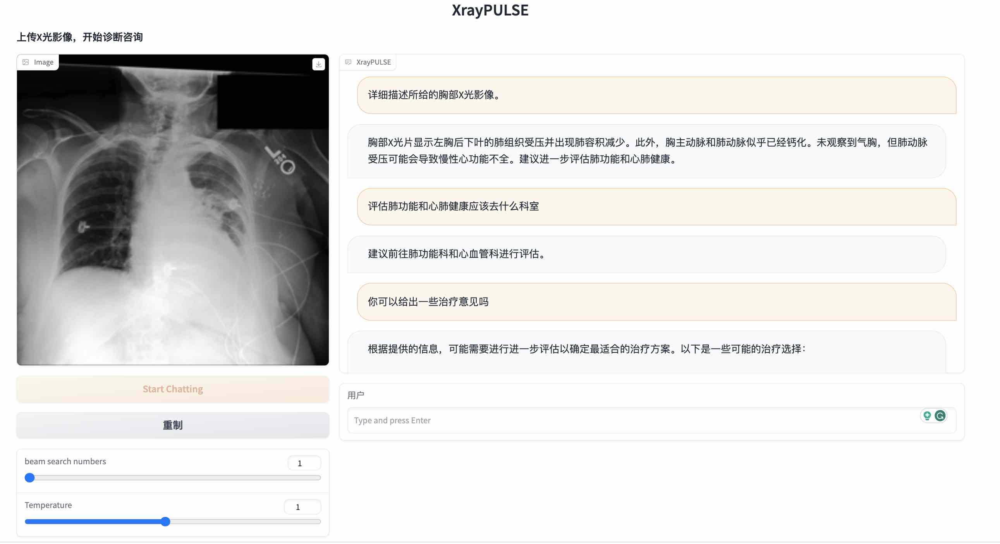
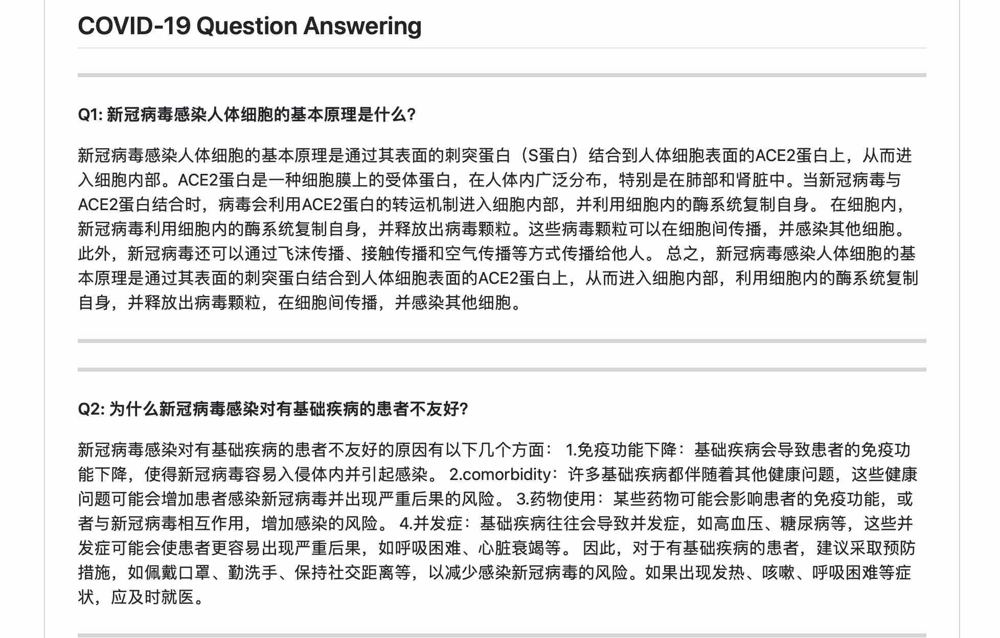
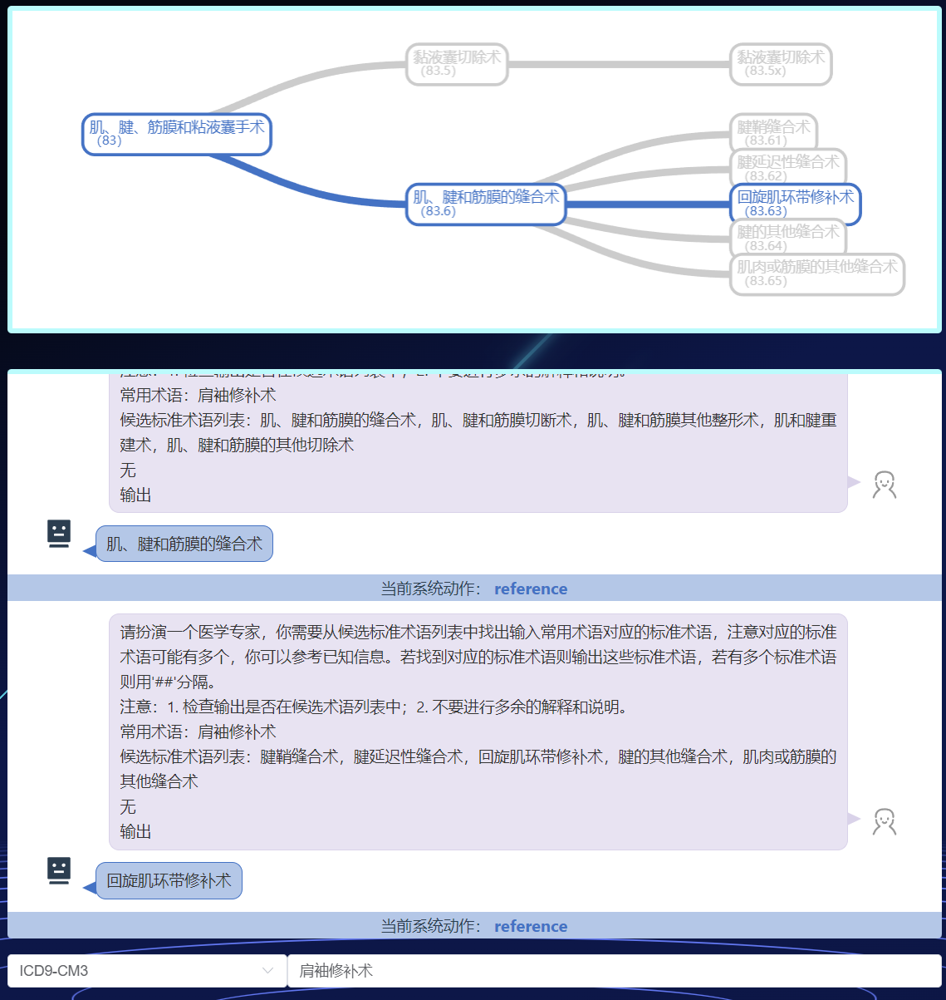
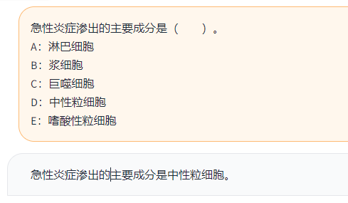
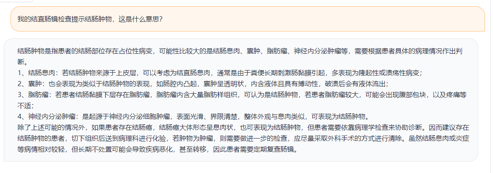

# PULSE

<p align="center" width="100%">

</p>

[](./LICENSE)
[](./MODEL_LICENSE)

\[[中文版](./README.md)\] \[[English](./README_en.md)\] 

## 目录

- [模型](#模型)
  - [主要功能](#主要功能)
  - [下载地址](#下载地址)
  - [局限性](#局限性)
  - [Elo评测](#Elo评测)
  - [相关应用](#相关应用)
  - [用例](#用例)
- [推理](#推理)
  - [硬件要求](#硬件要求)
  - [下载安装](#下载安装)
  - [使用示例](#使用示例)
- [友情链接](#友情链接)
- [致谢](#致谢)
- [开源协议](#开源协议)

----

## 模型

### 主要功能
- **中文医疗大语言模型**
- **大规模训练**：PULSE模型使用约4,000,000个中文医学领域和通用领域的指令微调数据进行进一步调优。
- **全面的中文医学自然语言处理任务**：PULSE支持医学领域的各种自然语言处理任务，包括健康教育、医师考试问题、报告解读、医疗记录结构化以及模拟诊断和治疗。

### 下载地址

- [**PULSE-7b**](https://huggingface.co/OpenMEDLab/PULSE-7bv5) (本模型基于[bloomz-7b1-mt](https://huggingface.co/bigscience/bloomz-7b1-mt)进行微调)
- 如果您需要更大的模型或者量化后的版本，欢迎[联系我们](mailto:xujie@pjlab.org.cn)建立合作。

### 局限性

- 本开源模型仅供医疗领域研究使用，尽管我们努力提供准确和最新的信息，但我们不能保证所提供信息的准确性、完整性或相关性，如使用本项目所含模型及其修改版本提供服务产生误导性或有害性言论，造成不良影响，与本项目无关。
- 由于模型参数量较小和自回归生成范式，尽管模型提供了有关疾病诊断和治疗的推理结果，但这些结果不能代替线下职业医生的建议和治疗方案。所有回答仅供参考，不应作为诊断或治疗的依据。我们强烈建议用户在需要诊断或治疗疾病时，寻求专业医生的帮助和建议。

### Elo评测
| model_name                    | model_size   |   ALL |   MedQA_Mainland |   PromptCBLUE |   webMedQA |
|:------------------------------|:-------------|------:|-----------------:|--------------:|-----------:|
| GPT4                          | 220B*8(?)    | 1206 | 1097 | 1188 | 1139 |
| PULSE_176b int4               | 176B         | 1136 | 1084 | 1118 | 1083 |
| ChatGPT                       | 175B(?)      | 1126 | 1060 | 1120 | 1087 |
| PULSE_14b w/ prompt           | 14B          | 1071 | 990 | 1042 | 1122 |
| PULSE_7b w/ prompt            | 7B           | 1065 | 1008 | 1046 | 1080 |
| PULSE_7b                      | 7B           | 1049 | 1016 | 1051 | 1037 |
| ChatGLM 2                     | 6B           | 1012 | 1023 | 994 | 1007 |
| HuatuoGPT_7b                  | 7B           | 953 | 1004 | 897 | 991 |
| QiZhenGPT                     | 13B          | 902 | 905 | 908 | 975 |
| BianQue                       | 6B           | 889 | 893 | 874 | 996 |
| Med-ChatGLM                   | 6B           | 818 | 954 | 873 | 791 |
| BenTsao                       | 7B           | 802 | 920 | 870 | 803 |
| DoctorGLM                     | 6B           | 779 | 896 | 852 | 801 |

#### 评估方法
* 为了平衡成本，我们主要采用GPT4进行评估。如[QLoRA](https://arxiv.org/abs/2305.14314) 论证，单纯GPT4打分进行模型的对比随机波动性较大。这与我们的观察一致。因此采用了[QLoRA](https://arxiv.org/abs/2305.14314) 推荐的，现在比较普遍采用的Elo Rating tournament评测方法。

#### 评估数据集 [[eval/data]](eval/data)
* MedQA_Mainland: 从[MedQA](https://github.com/jind11/MedQA)的Mainland/test子集中抽150条
* PromptCBLUE: 从[PromptCBLUE](https://github.com/michael-wzhu/PromptCBLUE)的test子集中抽150条 <!-- * detailedMedQA: 由医学专业人士标注的98条常见医疗领域问题的详尽回答 -->
* webMedQA: 从[webMedQA](https://github.com/hejunqing/webMedQA)的test子集中抽150条

#### 评测模型
* GPT4
* ChatGPT
* PULSE_176b int4 量化至int4
* PULSE_14b w/ prompt 加入了针对不同场景设计的prompts
* PULSE_7b w/ prompt 加入了针对不同场景设计的prompts
* [PULSE_7b](https://huggingface.co/OpenMEDLab/PULSE-7bv5)
* [ChatGLM2](https://github.com/THUDM/ChatGLM2-6B)
* [HuatuoGPT_7b](https://github.com/FreedomIntelligence/HuatuoGPT) (Backbone: Baichuan-7B)
* [QiZhenGPT](https://github.com/CMKRG/QiZhenGPT) (QiZhen-CaMA-13B-Checkpoint-6000)
* [BianQue](https://github.com/scutcyr/BianQue) (BianQue-2.0)
* [Med-ChatGLM](https://github.com/SCIR-HI/Med-ChatGLM)
* [BenTsao](https://github.com/SCIR-HI/Huatuo-Llama-Med-Chinese) (lora-alpaca-med-alpaca-alldata)
* [DoctorGLM](https://github.com/xionghonglin/DoctorGLM) (p-tuningv2)


#### 超参选择
* 出于成本考虑，我们选择每个数据集进行360轮随机评估，随机选择模型PK的先后顺序以抵消先后顺序的影响，随机种子为：42。Elo rating的实现代码和其他超参参照[Vicuna的Elo代码](https://raw.githubusercontent.com/lm-sys/FastChat/833d65032a715240a3978f4a8f08e7a496c83cb1/fastchat/serve/monitor/elo_analysis.py): K=8, init rating=1000。


### 相关应用

**XrayPULSE**

一款将医疗大语言模型PULSE与X-ray图像模型结合的应用，实现了多模态会话功能。

[openmedlab/XrayPULSE](https://github.com/openmedlab/XrayPULSE)



**PULSE-COVID-19**

一个基于PULSE微调且结合了广州实验室内部COVID-19知识数据库语料库的模型。

[openmedlab/PULSE-COVID-19](https://github.com/openmedlab/PULSE-COVID-19)



**病历结构化 (建设中)**

一个基于PULSE模型的结构化工具，旨在帮助用户处理和分析文本数据。它提供了单选、多选、信息提取等功能。

[JuneYaooo/llm_structure_tool](https://github.com/JuneYaooo/llm_structure_tool)


**术语归一化**

一个基于PULSE模型的医疗术语归一化的应用，归一化的任务是将临床上同一种诊断、手术、药品、检查、症状等各种不同的说法对应到标准用词上。

[JOHNNY-fans/NormPULSE](https://github.com/JOHNNY-fans/NormPULSE)

 

**知识库问答**

一款基于PULSE开发的聊天机器人，用户可以自己添加相关知识库，以开发更丰富的应用场景。

[JuneYaooo/medical_kb_chatbot](https://github.com/JuneYaooo/medical_kb_chatbot)


### 简单用例

**健康科普**


**医师考题**



**报告解读**



<!-- **病历结构化**

 -->

**模拟诊疗**


**医学无关问题无害处理**


## 推理
### 硬件要求

下表提供了一个batch size=1时本地部署PULSE进行推理所需的显存大小。

| 量化等级 | 加载模型 |
| -------- | -------- |
| FP16     | 14GB     |


### 下载安装
1. 下载本仓库内容至本地/远程服务器

```bash
git clone https://github.com/openmedlab/PULSE
cd PULSE
```

2. 创建conda环境安装依赖

```bash
conda env create -f llm.yml
conda activate llm
```

其中`torch`和`transformers`版本不建议低于推荐版本。

### 使用示例

#### 网页Demo

**Gradio**

```bash
python web_demo_gradio.py
```

#### 命令行Demo

您可以运行仓库中的`cli_demo.py`来启动一个简单的命令行Demo：

```bash
python cli_demo.py
```

## 友情链接

- [xxxxx]() - 关于PULSE及其相关技术的分享

如果您有其他开源项目使用或改进PULSE，欢迎提交Pull Request添加到README或在Issues中联系我们。

## 致谢

- 上海人工智能实验室
- 上海交通大学-清源研究院
- 华东理工大学-自然语言处理与大数据挖掘实验室


## 开源协议

本项目所含代码采用[Apache 2.0](https://github.com/openmedlab/PULSE/blob/main/LICENSE)协议，模型权重采用[GNU AGPL 3.0](https://github.com/openmedlab/PULSE/blob/main/MODEL_LICENSE)协议。

<!-- ## Star History

[](https://star-history.com/#openmedlab/PULSE&Date) -->
